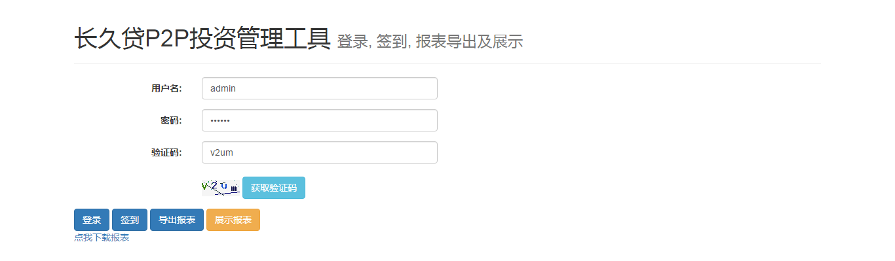
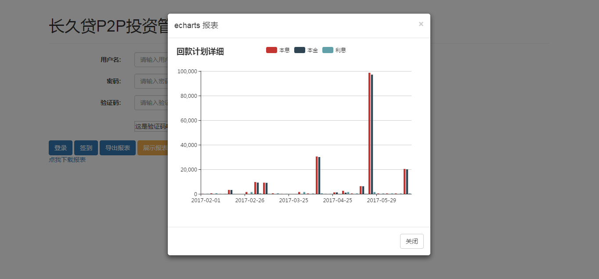

# interest_summary
a demo to show interest capturing data from website and show charts with echarts
- - - 

1. use **redis** as data storage
2. design some kind of **structure** type in redis, don't use js to handle the raw data
3. use **echarts** to show the final results
4. get the **bonous** type & number, showing in the page for reference
5. add permission control
6. for config. file, save something security data use complicate method, eg. BASE64 and then exchange some character
7. TBC

- - -
update currently

## 主页

## 弹出窗口显示统计报表

